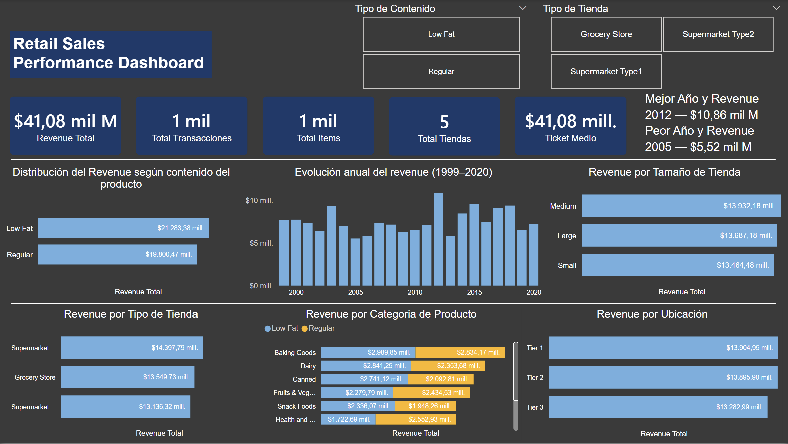
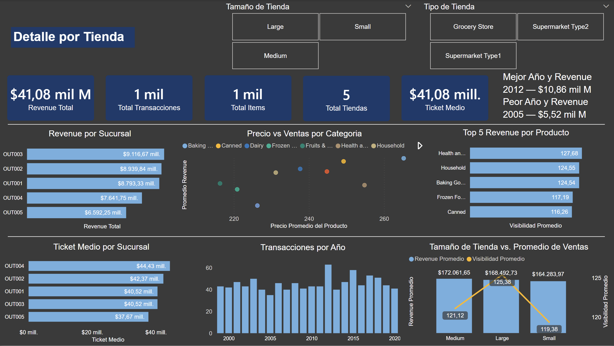

# Retail Sales Performance Dashboard

Dashboard de análisis de ventas retail desarrollado en Power BI como proyecto personal. Cubre datos de 5 sucursales entre **1999 y 2020**, con foco en revenue, comportamiento por categoría y rendimiento por tienda.

## Vista del proyecto

*Vista general — KPIs principales y evolución anual del revenue.*

*Detalle por sucursal — ticket medio, visibilidad y precio vs. ventas.*

## ¿Qué analiza?

El dashboard tiene dos páginas: la primera da una visión general del negocio y la segunda profundiza en el detalle por sucursal. Juntas permiten responder preguntas como:

- ¿Cómo evolucionaron los ingresos a lo largo de 20 años?
- ¿Qué tiendas y categorías generan más revenue?
- ¿Hay diferencias reales entre tamaños de local?
- ¿Qué relación existe entre el precio promedio y las ventas por categoría?

## Stack

- **Power BI Desktop** — visualizaciones e interactividad
- **DAX** — KPIs y medidas personalizadas
- Modelado de datos básico

##  Lo que encontré

- **2012** fue el mejor año ($10,86M); **2005**, el peor ($5,52M).
- Los tres tamaños de tienda (Small, Medium, Large) tienen revenue total casi idéntico, pero en promedio las tiendas **Medium lideran**.
- La distribución entre productos **Low Fat** y **Regular** es prácticamente 50/50.
- **Baking Goods** y **Dairy** lideran en ventas; **Health & Household** encabeza en visibilidad promedio.
- **OUT003** tiene el mayor revenue total, pero **OUT004** tiene el ticket medio más alto ($44,43).
- Las ubicaciones por Tier (1, 2 y 3) muestran diferencias mínimas — el negocio está bien distribuido geográficamente.

## Autor

**Thomas Nuñez** — proyecto personal para seguir creciendo en análisis de datos y visualización.
